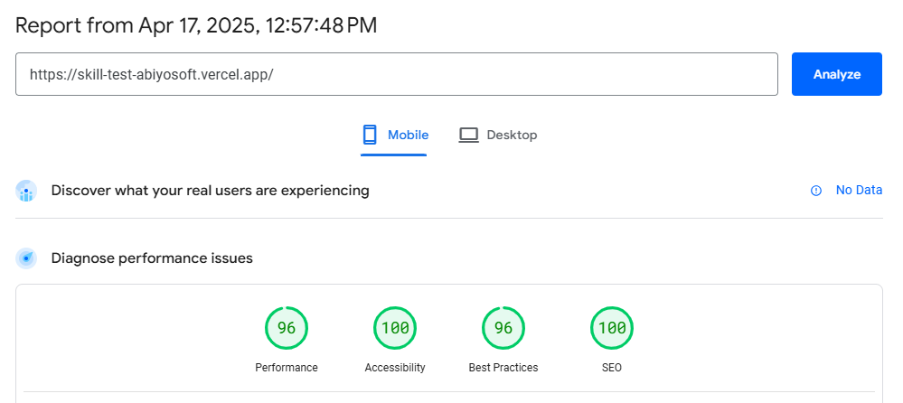

Report: [https://pagespeed.web.dev/analysis/https-skill-test-abiyosoft-vercel-app/06pwogv20j?form_factor=mobile](https://pagespeed.web.dev/analysis/https-skill-test-abiyosoft-vercel-app/06pwogv20j?form_factor=mobile)

## Table of Contents

- [Table of Contents](#table-of-contents)
- [Setup ENV](#setup-env)
- [Getting Started](#getting-started)
  - [Install dependencies](#install-dependencies)
  - [Run the development server](#run-the-development-server)
  - [Run production version](#run-production-version)

## Setup ENV

Create .env and fill

```txt
NEXT_PUBLIC_MAP_TILER_KEY=<YOUR_KEY>
```

[Get Key Here](https://cloud.maptiler.com/account/keys/)

## Getting Started

### Install dependencies

```sh
npm i
# or
yarn i
# or
pnpm i
# or
bun i
```

### Run the development server

```sh
npm run dev
# or
yarn dev
# or
pnpm dev
# or
bun dev
```

Open [http://localhost:4567](http://localhost:4567) with your browser to see the result.

### Run production version

```sh
npm run build && npm start
# or
yarn build && yarn start
# or
pnpm build && pnpm start
# or
bun build && bun start
```

Open [http://localhost:4567](http://localhost:4567) with your browser to see the result.
